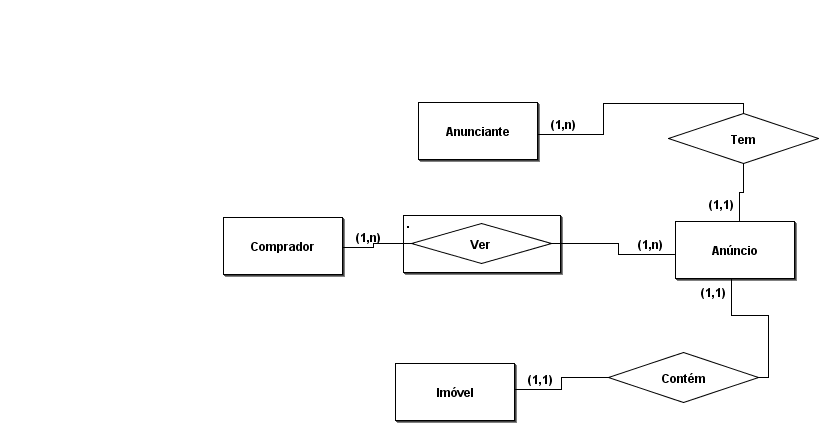

# Décimo Andar

###### Projeto desenvolvido para a disciplina PROJETO INTEGRADOR: DESENVOLVIMENTO DE SISTEMAS ORIENTADO A OBJETOS presente no 3° Semestre do curso superior em Tecnologia em Analise e Desenvolvimento de Sistemas.

O Décimo Andar é uma plataforma completa que conecta anunciantes e compradores de imóveis, facilitando a busca por casas à venda ou para locação.  

## Funcionalidades

### Para Anunciantes:

- Cadastro completo: Inclua nome, telefone, e-mail, fotos da residência e documentos (escritura ou matrícula do imóvel) para garantir a segurança da plataforma;
- Anúncios detalhados: Crie anúncios completos com CEP, fotos de cada cômodo, questionário sobre a residência e opção para venda ou locação;
- Gerenciamento de anúncios: Edite ou exclua seus anúncios com facilidade (exceto CEP/endereço).

### Para Compradores:

- Busca avançada: Encontre o imóvel dos seus sonhos com filtros por CEP, tipo de negociação (venda/locação), características e muito mais;
- Contato seguro: Visualize o telefone do anunciante após cadastro com validação de documento (frente e verso e foto do rosto);
- Compartilhamento de anúncios: Compartilhe anúncios com amigos e familiares para encontrar o imóvel ideal em conjunto.

## Segurança e confiabilidade:

Validação de documentos para compradores para garantir um ambiente seguro para todos.

#### Observações:

O Décimo Andar não é responsável pela venda ou locação de imóveis.  
A plataforma serve apenas como um meio de contato entre anunciantes e compradores.

## Modelo Entidade-Relacionamento

## Integrantes
[Ecthor Silva](https://github.com/EcthorSilva),
[Gulherme Soares](https://github.com/Guisoaresz13),
[Vitor Maia](https://github.com/Vitorhsmaia),
[Felipe Nobre](https://github.com/FellipeNobre),
[Christian Freitas](https://github.com/Christianfreitas12) e 
[Otavio Augusto](https://github.com/0tav10280818).

## Contribuição
Este projeto foi desenvolvido para fins educacionais, portanto, não aceitamos contribuições para o mesmo. No entanto, sugestões e feedbacks são bem-vindos.